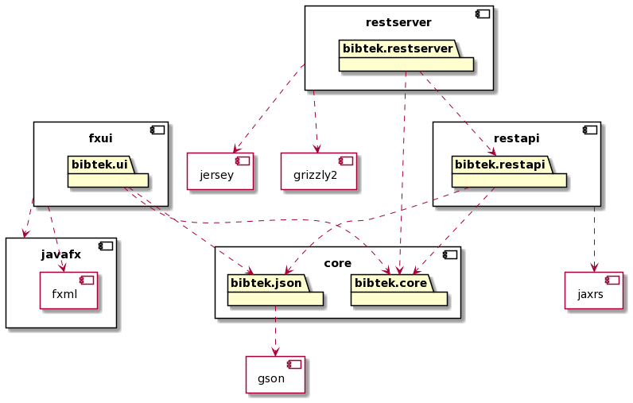

# Bibtek

## Architecture layers

The project is a three layered application consisting of the following layers:

- **domain** (*[bibtek.core](core/src/main/java/bibtek/core)*) - classes to represent data models used in the app
- **persistance** (*[bibtek.restapi](core/src/main/java/bibtek/restapi)* and *[bibtek.json](core/src/main/java/bibtek/json)*) - handles storing and loading of user generated data
- **user interface** (*[bibtek.ui](fxui/src/main/java/bibtek/ui)*) - handles display to screen and user input

## Modules

The app is also divided into these modules:
- **core** - domain and persistance
- **fxui** - user interface
- **integrationTests** - test integration with backend
- **restapi** and **restserver** - backed and persistance

This enables for example dependencies like **javafx** to be exclusive for the parts that actually need it

This does not mean that the modules are completely independent (e.g. the **fxui** module depends on the **core** module)

## Source code structure

- **../src/main/java** application code
- **../src/main/resources** mainly FXML-files and app icon (in **fxui**-module)
- **../src/test/java** for testing

## Maven setup

The project utilizes the build tool Maven for handling things like dependencies and test initialization.

Dependencies include:

- **javafx-fxml** - JavaFX (only **fxui**-module)
- **junit-jupiter-api, junit-jupiter-engine, mockito-core** - testing with JUnit5
- **testfx-core, testfx-junit5** - testing with TestFX
- **gson** - JSON serialization and deserialization  (only **core**-module)

in addition to the following plugins:

- **maven-compiler-plugin** - Java setup
- **maven-surefire-plugin** - testing
- **javafx-maven-plugin** - running JavaFX
- **maven-checkstyle-plugin, spotbugs-maven-plugin** - code quality check
- **jacoco-maven-plugin** - code coverage
