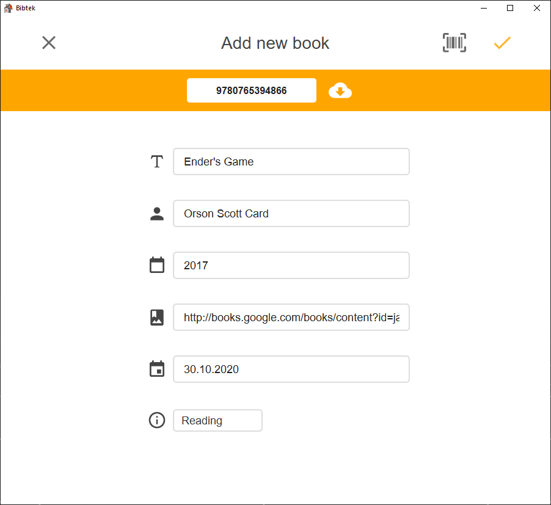

# Bibtek

Bibtek is a home library management application, aiming to simplify user's reading list. Built with JavaFX with Maven, Bibtek is great for desktop use. Project files can be found in the [**/biktek/**](/bibtek) folder.

## Description

User stories

Adding a new book (us-1)

- As a user I would like to add a new book to my library with relevant information like book title, date added and reading status

View all books in my library (us-2)

- As a user I would like to get an overview of all the books that have been added to my library

Deleting a book (us-3)

- As a user I would like to delete a book I don't want in my library

View individual books (us-4)

- As a user I would like to view each individual book by themself

View details about each book (us-5)

- As a user I would like to view details about my book, like author, date of publishing, edition, description, length and ISBN number

Personal profile with its own library available online (us-6)

- As a user I would like to have my own profile, which has my library of books online, such that I can have access to that library wherever I go

Log in to library (us-7)

- As a user I want to log in to my library

Make a user (us-8)

- As a user I want to create a user

Search for books to add to library (us-9)

- As a user I want to search for books, either with ISBN number or with manual details

Edit books in library (us-10)

- As a user I want to edit the books in my library

Log out off bibtek (us-11)

- As a user I want to log out when I'm finished with my tasks

## Building and running the app
The project utilizes maven for building and running.

Before running the app, it needs to be built.

1. Building is done with `mvn install` from the app's root folder [**/bibtek/**](/bibtek)

    (additionally `-Dfast` is used to skip *surefire* tests, *checkstyle* and *spotbugs*, and `-DskipIntegrationTests` to skip *failsafe* integration tests)

2. Running the app is done through the fxui module with the command `mvn javafx:run -f fxui`

3. Running back-end is done through the restserver module with the command `mvn exec:java -f restserver`

## Screenshot

