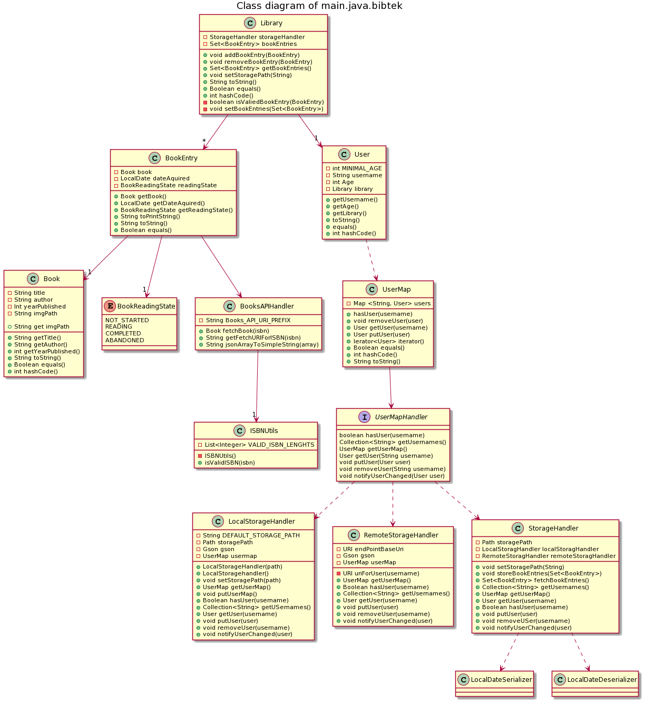

# Domain layer

The domain layer consists of the data classes used to represent the users personal library.

**Book** represents a book with title, author and publication year

**BookEntry** contains a **Book** with extra user-specific info like date acquired and reading state

**Library** contains the users book entries, but also handles data storing and loading through the **StorageHandler** from *bibtek.json*.

**StorageHandler** uses **LocalDateSerializer** and **LocalDateDeserializer** to serialize and deserialize (respectively) LocaDate obejcts. 

