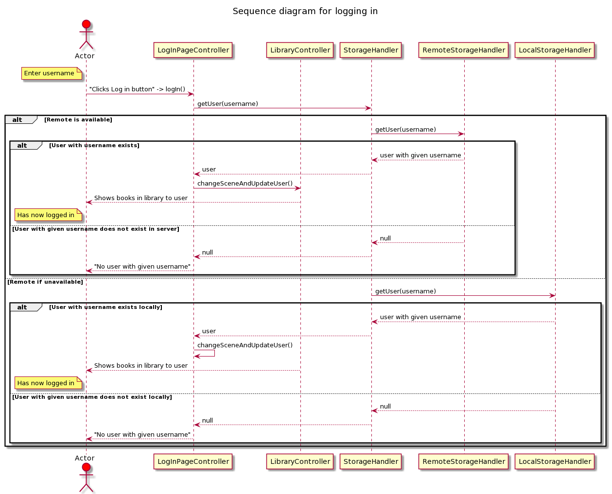
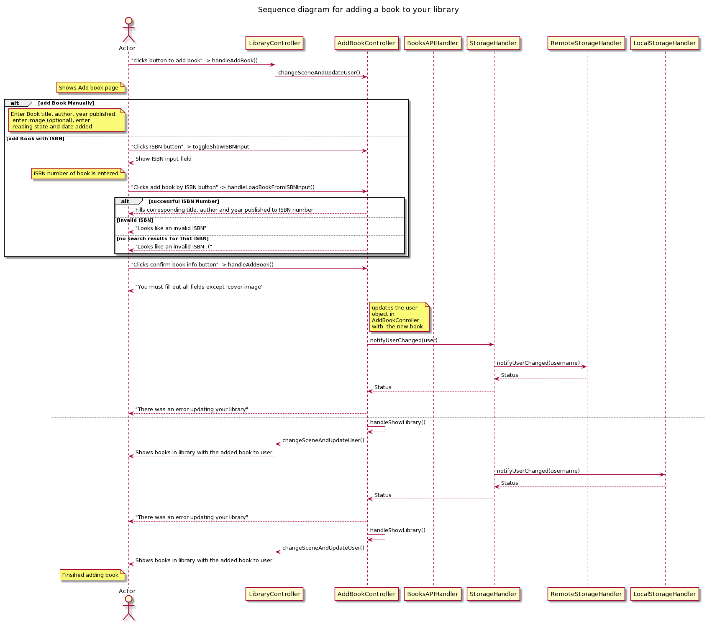

# User interface layer

The user interface layer uses JavaFX and FXML markup.

The **Library** scene displays the users personal library consisting of the books added and their related data.

The **AddBook** screen lets the user add new books.
Currently the attributes are limit to title, author, publishing year, date of acquisition and reading state.

**Sequence diagram for logging in**

**Sequence diagram for adding book**

